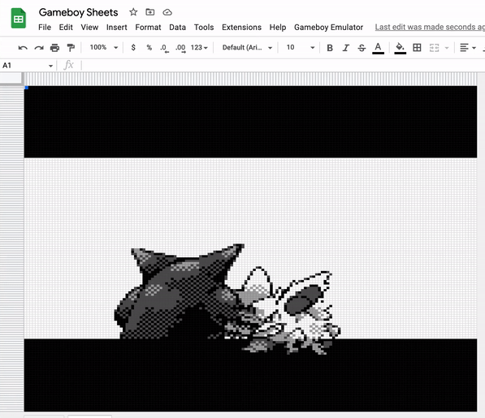
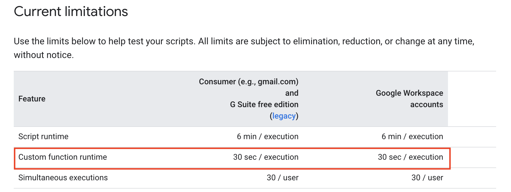

# Gameboy Sheets

A Gameboy emulator that draws using Google Sheets using [gameboy.js](https://github.com/juchi/gameboy.js) as a core.

## Usage

The sheet is located [here](https://docs.google.com/spreadsheets/d/1W0f9jmZixQqK2EMZImZoIlqF-MXp1-Ek6mDdX2gfmWo). Click "File" then "Make a copy" to get your own version. In the tool bar,
you can click the "Gameboy Emulator" tab to open the side dialog.

When opening you may get a scary popup like:

Just scroll down and click "Go to Gameboy Sheets". Afterwards, you might be greeted with a popup about permissions, just do the same thing.

Drag and drop or click and upload your gameboy ROM and the emulation should start automatically.

Click the canvas above to capture input and your good to go!

## How does it work

First the emulator was hosted server side but Google decided that scripts could only run for 30 seconds.

This make emulation on the server impossible. Instead, I opted to creating a sidebar which run the gameboy emulation and sends a draw command every frame
to the Google sheets server. Since commands execute asynchronously and Google has a limit for sent commands,
frames are stored in a queue which is sent only when the previous command is done executing which is another bottleneck.

## Limitations

- It's slow.
- No way to queue commands on the server, so the client has to send them one-by-one.